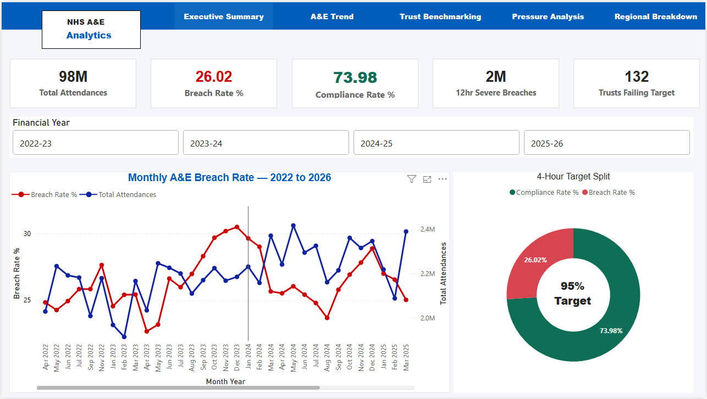
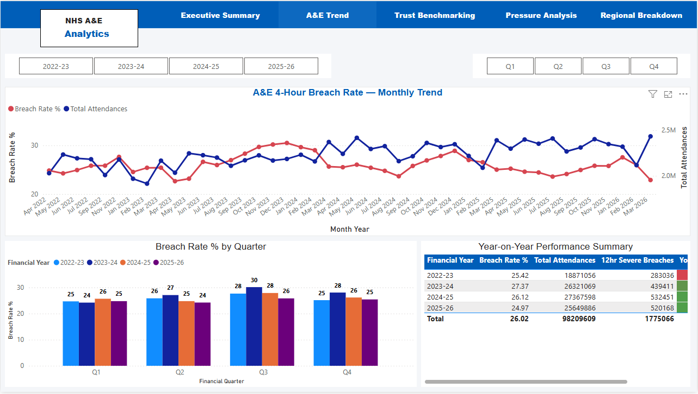
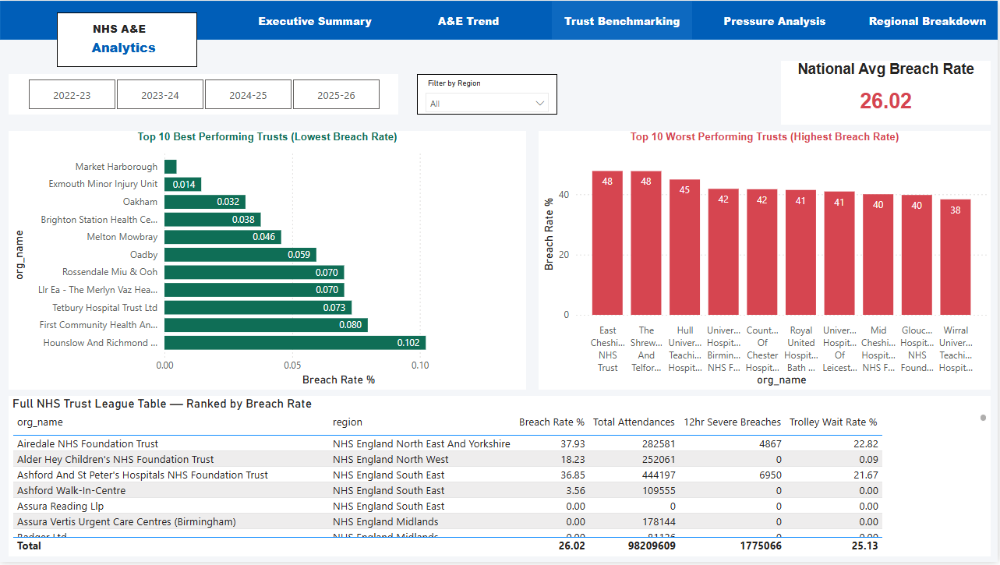
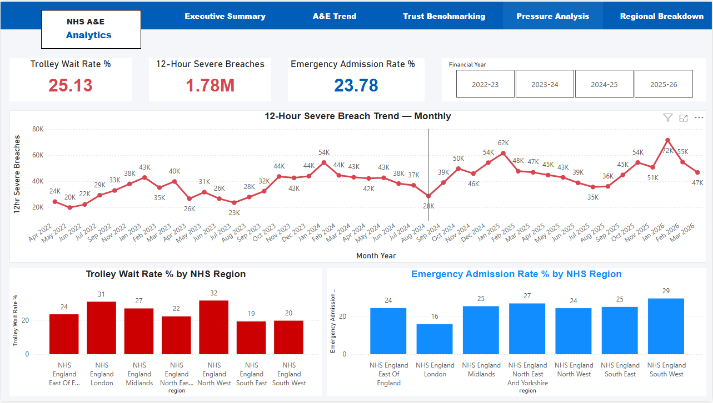
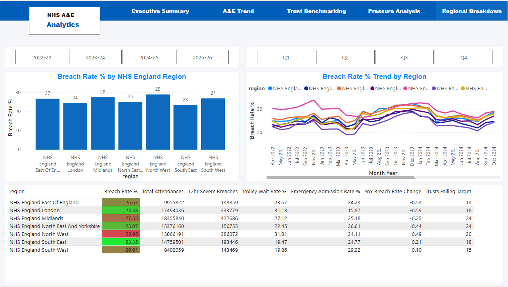

# 🏥 NHS A&E Performance Analytics — PostgreSQL · Python · Power BI

> A full end-to-end healthcare data analytics project built on **real NHS England data** — covering A&E performance, trolley waits, 12-hour severe breaches, and regional benchmarking across 200+ NHS Trusts over four financial years (2022–2026).

🔗 **[View Live Dashboard →](https://app.powerbi.com/your-link-here)**

---

## 📌 Project Overview

NHS A&E performance data is published monthly by NHS England but exists as 48 separate Excel files — each with 14 rows of metadata, suppressed values, and inconsistent formatting. There is no single view that shows how performance has changed over time, which Trusts are failing, or what is driving the crisis.

I built a complete data pipeline and interactive Power BI dashboard that takes all 48 raw Excel files, loads them into PostgreSQL using a Python script, cleans the data with SQL, and delivers a 5-page performance dashboard showing four years of NHS A&E performance across England.

**Data source:** NHS England — A&E Attendances and Emergency Admissions  
**Licence:** Open Government Licence v3.0  
**Period covered:** April 2022 to March 2026 (4 complete NHS financial years)  
**Scale:** 98.2 million A&E attendances · 200+ NHS Trusts · 8,819 rows  
**Tools:** PostgreSQL 13 · Python 3 · pgAdmin 4 · Power BI Desktop · DAX  
**Pages:** 5 (Executive Summary, A&E Trend, Trust Benchmarking, Pressure Analysis, Regional Breakdown)

---

## 📊 Key Findings

| Metric | Value | NHS Target |
|--------|-------|------------|
| Overall 4-Year Breach Rate | **26.02%** | Below 5% |
| Compliance Rate | **73.98%** | Above 95% |
| Total 12-Hour Severe Breaches | **1,775,066** | Zero |
| Trolley Wait Rate | **25.13%** | Lower = better |
| Trusts Failing Target | **132 out of ~200** | Zero |
| Best Region (South East) | **23.35%** breach rate | — |
| Worst Region (North West) | **28.95%** breach rate | — |

- Performance **worsened in 2023-24** (27.37%) then gradually recovered to 24.97% in 2025-26
- **12-hour severe breaches grew 88%** from 2022-23 (283,036) to 2024-25 (532,451)
- A clear **winter pressure spike** repeats identically every year — a structural problem
- Root cause of breaches is **hospital bed capacity**, not A&E speed — confirmed by trolley wait correlation
- **South West** is the only region where performance worsened year-on-year (+0.10)

---

## 📄 Dashboard Pages

### 1. Executive Summary

The entry point of the report. Shows the national A&E picture at a glance — five KPI cards, a monthly breach rate trend, a compliance vs breach donut chart, and a financial year slicer.



**Key metrics visible:**
- **98M** total attendances · **26.02%** national breach rate · **73.98%** compliance rate
- **2M** total 12-hour severe breaches · **132** Trusts currently failing the 95% target
- Monthly trend from April 2022 to March 2026 showing both breach rate and attendance volume
- Donut chart: 73.98% compliance vs 26.02% breach — compared against the 95% target line

---

### 2. A&E Performance Trend

A time-series deep dive. Shows how breach rate has changed month by month across all four years, with quarterly breakdowns and a year-on-year comparison table.



**Key metrics visible:**
- Monthly breach rate and total attendances on dual-axis line chart — April 2022 to March 2026
- Quarterly bar chart: all 4 years side by side showing Q1–Q4 patterns
- Year-on-Year performance summary table with conditional formatting (green = improving, red = worsening)
- Financial year and quarter slicers for interactive filtering

---

### 3. Trust Benchmarking

A league table of all 200+ NHS Trusts ranked by breach rate. Identifies the best and worst performing Trusts and allows filtering by region.



**Key metrics visible:**
- Top 10 best performing Trusts (lowest breach rate) — horizontal bar chart, green
- Top 10 worst performing Trusts (highest breach rate) — horizontal bar chart, red
- Full league table: Trust name · Region · Breach Rate % · Total Attendances · 12hr Breaches · Trolley Wait Rate
- National average breach rate card: **26.02%** — updates when filtered by region or year
- Region dropdown slicer and financial year tile slicer

---

### 4. Pressure Analysis

Explains *why* Trusts are failing. Focuses on trolley waits and 12-hour severe breaches — the capacity pressure indicators that drive A&E breach rates.



**Key metrics visible:**
- **25.13%** trolley wait rate · **1.78M** 12-hour severe breaches · **23.78%** emergency admission rate
- 12-hour severe breach monthly trend — peaks of 60K–80K per month in winter
- Trolley Wait Rate % by all 7 NHS regions — North West highest at 31.81%
- Emergency Admission Rate % by region — South West highest at 29.22%

---

### 5. Regional Breakdown

Compares all 7 NHS England regions across every KPI. Identifies geographic performance gaps and regional trends over time.



**Key metrics visible:**
- Breach Rate % by region: South East best (23.35%) · North West worst (28.95%)
- Regional trend line chart: all 7 regions plotted month by month — shows which regions are converging or diverging
- Full regional summary table: Breach Rate · Attendances · 12hr Breaches · Trolley Wait · Emergency Admission Rate · YoY Change · Trusts Failing Target
- South West flagged as only region with worsening YoY performance (+0.10)

---

## 🛠️ How It Was Built

| Layer | Detail |
|---|---|
| **Database** | PostgreSQL 13 — staging table + clean analytical fact table |
| **Loading** | Python 3 (pandas + psycopg2) — automated loading of all 48 Excel files |
| **Cleaning** | SQL — NULLIF chains for * and - values, ::DECIMAL::INTEGER casting, breach rate calculation |
| **Data model** | Power BI star schema — fact_ae_monthly + dim_date + dim_organisation |
| **Measures** | 9 DAX measures — Breach Rate %, Compliance Rate %, Trolley Wait Rate %, YoY Change, and more |
| **Dashboard** | 5-page Power BI report with clickable navigation using Bookmarks and Buttons |
| **Filters** | Financial Year · NHS Quarter · NHS Region — interactive slicers on every page |

---

## 🗂️ Data Pipeline

```
48 NHS Excel files (monthly, April 2022 – March 2026)
        ↓
Python script — load_nhs_ae_data.py
Reads each file · skips 14 metadata rows · assigns column names · loads to PostgreSQL
        ↓
PostgreSQL staging table — stg_ae_raw
All columns VARCHAR · raw data preserved exactly · ~8,819 rows
        ↓
SQL cleaning query
* → NULL · - → NULL · ::DECIMAL::INTEGER cast · breach rate calculated · quarter derived
        ↓
PostgreSQL clean table — fact_ae_monthly
33 columns · proper data types · breach_rate_pct · is_suppressed flag
        ↓
Power BI — star schema data model
fact_ae_monthly ←→ dim_date (period_date → Date)
fact_ae_monthly ←→ dim_organisation (org_code → org_code)
        ↓
5-page interactive dashboard
```

---

## 📁 Repository Structure

```
nhs-ae-performance-analytics/
│
├── load_nhs_ae_data.py              # Python script — loads 48 NHS Excel files into PostgreSQL
│
├── sql/
│   ├── 01_create_staging_table.sql  # stg_ae_raw — raw data, all VARCHAR
│   ├── 02_create_fact_table.sql     # fact_ae_monthly — clean, typed, calculated
│   ├── 03_cleaning_query.sql        # Full cleaning query with all 5 rules applied
│   └── 04_profiling_queries.sql     # 6 data profiling checks to run before cleaning
│
├── assets/
│   ├── executive_summary.png
│   ├── ae_trend.png
│   ├── trust_benchmarking.png
│   ├── pressure_analysis.png
│   └── regional_breakdown.png
│
└── docs/
    ├── NHS_AE_Project_Description_and_Findings.docx
    └── NHS_Complete_Study_Guide.docx
```

---

## 🔑 Key Technical Decisions

**Why PostgreSQL over Excel for analysis?**  
48 Excel files with merged headers and suppressed values cannot be queried reliably. PostgreSQL allows repeatable, auditable SQL analysis across all 48 months simultaneously.

**Why a staging table before cleaning?**  
Raw data is never edited. The staging table preserves the original data so cleaning can be re-run at any time without re-loading the files.

**Why ::DECIMAL::INTEGER in the cleaning query?**  
Python reads Excel numbers as floats — storing 13,316 as "13316.0". PostgreSQL cannot cast "13316.0" directly to INTEGER. The two-step cast (::DECIMAL then ::INTEGER) handles this correctly.

**Why FIRSTNONBLANK in dim_organisation?**  
Some NHS Trusts changed their name during the 4-year period. SUMMARIZE would create duplicate org_code rows. FIRSTNONBLANK guarantees one row per Trust regardless of name changes.

**Why mark dim_date as a Date Table?**  
Power BI time intelligence functions (SAMEPERIODLASTYEAR, TOTALYTD) only work correctly when a dedicated Date Table is marked. Without this, year-on-year comparisons return wrong results.

*NHS data published by NHS England under the Open Government Licence v3.0.*  
*This project is for portfolio and educational purposes only.*
